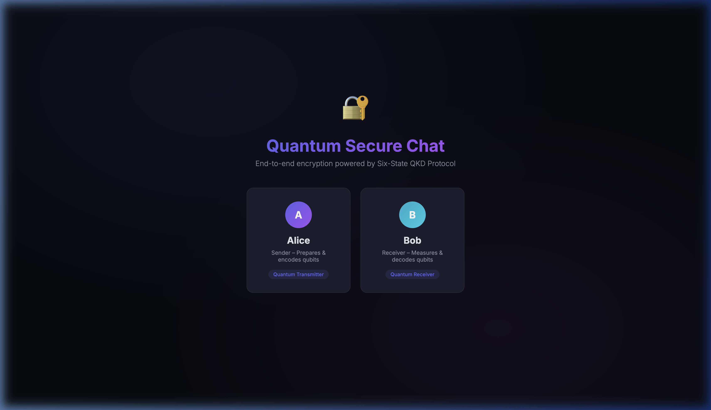
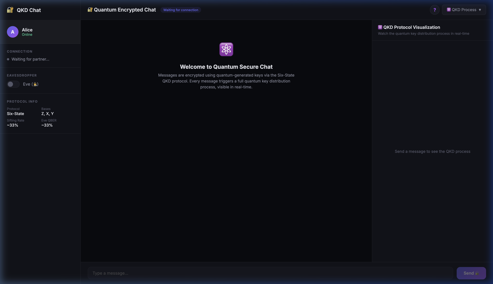

# 🔐 QChat-SixState

A real-time **quantum-encrypted chat application** powered by the **Six-State QKD Protocol**. Alice and Bob exchange messages encrypted with one-time pad keys generated via quantum key distribution — with every step of the quantum process visualized live.

Built with [Qiskit](https://qiskit.org/) for quantum simulation and [Flask-SocketIO](https://flask-socketio.readthedocs.io/) for real-time communication.

---

## ✨ Features

- **Real-time QKD visualization** — Watch qubit preparation, channel transmission, basis reconciliation, QBER estimation, key generation, encryption, and decryption unfold step-by-step
- **Eavesdropper simulation** — Toggle Eve's intercept-resend attack and see how QBER spikes from ~0% to ~33%, proving quantum eavesdropping is fundamentally detectable
- **One-Time Pad encryption** — Messages are XOR-encrypted with quantum-generated keys (information-theoretically secure)
- **Premium dark UI** — Glassmorphism design with smooth animations, quantum state tables, and per-message security metrics
- **Built-in protocol guide** — Interactive help modal explaining every step of the Six-State protocol

---

## 📸 Screenshots

### Role Selection


### Chat Interface with QKD Visualization


---

## 🛠️ Local Setup

### Prerequisites

- **Python 3.10+**
- **pip** (comes with Python)
- **Git**

### Installation

```bash
# Clone the repository
git clone https://github.com/rennnss/QChat-SixState.git
cd QChat-SixState

# Create & activate a virtual environment
python -m venv venv
source venv/bin/activate        # macOS / Linux
# venv\Scripts\activate         # Windows

# Install dependencies
pip install -r requirements.txt
```

### Running the App

```bash
python chat/chat_server.py
```

Open **two browser tabs** at [http://localhost:5050](http://localhost:5050):
1. Join as **Alice** in one tab
2. Join as **Bob** in the other tab
3. Start chatting — every message triggers a full QKD key exchange, visible in real-time

> **Tip:** Toggle the **Eve switch** in the sidebar to simulate an eavesdropper and watch the QBER increase.

---

## 📁 Project Structure

```
QChat-SixState/
├── chat/
│   ├── chat_server.py            # Flask + SocketIO server (entry point)
│   ├── templates/index.html      # Chat UI
│   └── static/
│       ├── app.js                # Client-side logic & QKD visualization
│       └── style.css             # Premium dark theme
├── quantum/
│   ├── alice.py                  # Sender — qubit preparation
│   ├── bob.py                    # Receiver — qubit measurement
│   ├── eve.py                    # Eavesdropper — intercept-resend attack
│   ├── channel.py                # Noise models (bit-flip, depolarizing)
│   └── utils.py                  # Basis enums, circuit builders
├── protocols/
│   ├── base.py                   # Abstract QKD protocol + sifting
│   ├── six_state.py              # Six-State protocol implementation
│   └── bb84.py                   # BB84 protocol implementation
├── analysis/
│   ├── qber.py                   # QBER computation & sampling
│   └── key_rate.py               # Secure & effective key rate estimation
├── visualization/
│   └── plots.py                  # Matplotlib visualizations
├── tests/                        # Comprehensive pytest suite (64 tests)
├── screenshots/                  # UI screenshots
├── requirements.txt
└── README.md
```

---

## 🧪 Testing

```bash
# Run all tests
python -m pytest tests/ -v

# Run Six-State protocol tests only
python -m pytest tests/test_six_state.py -v
```

---

## 📖 How It Works

The **Six-State protocol** uses three mutually unbiased bases (MUBs):

| Basis | States | Description |
|-------|--------|-------------|
| **Z** (⊕) | \|0⟩, \|1⟩ | Computational basis |
| **X** (⊗) | \|+⟩, \|−⟩ | Hadamard basis |
| **Y** (◉) | \|+i⟩, \|−i⟩ | Circular basis |

**When you send a message, this happens:**

1. **Alice prepares** random qubits in random bases (Z, X, Y)
2. **Quantum channel** transmits qubits (Eve may intercept)
3. **Bob measures** each qubit in a randomly chosen basis
4. **Basis sifting** — keep only matching bases (~33% survive)
5. **QBER estimation** — compare a sample to detect errors
6. **Key generation** — remaining bits form the shared secret
7. **OTP encryption** — message XOR'd with the quantum key
8. **Decryption** — receiver XOR's ciphertext with their key copy

### Eve's Attack

When Eve intercepts, she guesses the wrong basis **2/3 of the time**, introducing a QBER of ~33% — making eavesdropping **always detectable**.

| Property | Six-State | BB84 |
|----------|-----------|------|
| Bases | Z, X, Y | Z, X |
| Sifting rate | ~33% | ~50% |
| Eve's QBER | ~33% | ~25% |
| Security margin | Higher | Lower |

---

## 📄 License

MIT
